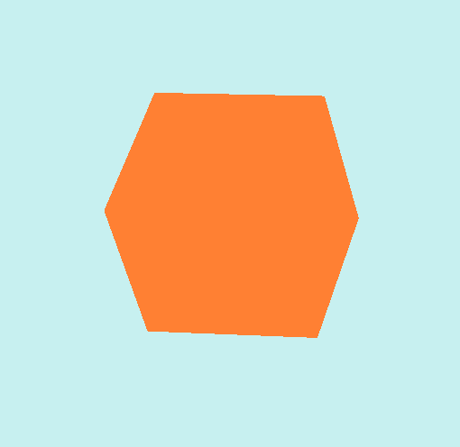

<h1>Welcome to my Game Engine!<h1/>
<h2>!!!This Project is currently in developement<h2/>
  
    
  

  <h2 style="color: #363636; cursor:pointer; padding-bottom:1.5vh;" onclick="button();">Hello Cube<h2/>
    

  
First I created a window using SFML. 
    Then I drew a simple cube using a simple color shader  and a vertex and an index buffer.

  
      

    

  <h2>Texturing<h2/>
    
First I had to Load an Image. 
      This was quite simple, I just used a simple .bmp loadingscript. 
       
      Then I had to make a uv buffer wich was quite annoying since I was using an index buffer to use less vertices. This meant I had to also index my UV's 
      The funny thing is is that opengl doesn't allow multiple index buffers, so because my uv buffer was longer then my vertices buffer this proved quite diffecult. 
      That is also why is dicided to first focus on the texturing and fix the index buffer later.
        Result:     
    

